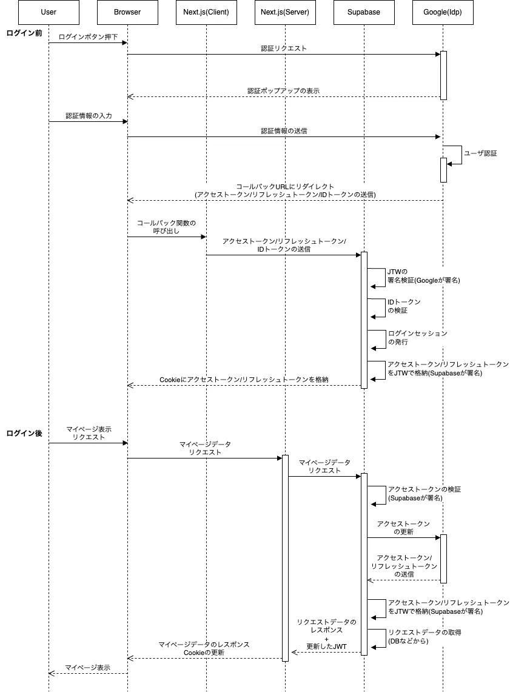

# Next.js / Supabase / Google(One-tap) での Social Login の実装方法＆処理フローの整理

## はじめに

本記事では、Next.js / Supabase / Google(One-tap) での Social Login の実装方法と、処理フローについて整理します。

公式ドキュメントに実装方法の記載はありますが、自分で実装する際に詰まったので、備忘録として残しておきます。

## 実装手順

1. Google Cloud と Supabase の設定

[こちらのドキュメント](https://supabase.com/docs/guides/auth/social-login/auth-google#google-pre-built-configuration)をもとに Google Cloud 側(Idp)の設定を行います。

2. Next.js アプリへのログインボタンの配置

公式の手順は[こちら](https://supabase.com/docs/guides/auth/social-login/auth-google#google-pre-built)です。

最終的なコードがどうなるのかあまりイメージがついてなく、詰まったのでうまくいった方法を下記に記載しておきます。

```tsx
'use client';

import { createClient } from '@/utils/supabase/client';
import Script from 'next/script';
import { useRouter } from 'next/navigation';
import { useCallback } from 'react';

const GoogleSignIn = () => {
  const router = useRouter();
  const supabase = createClient();

  // handleCallbackをuseCallbackで定義
  const handleCredentialResponse = useCallback(
    async (response: any) => {
      try {
        const { data, error } = await supabase.auth.signInWithIdToken({
          provider: 'google',
          token: response.credential,
        });

        if (error) throw error;

        console.log('Logged in:', data);
        router.refresh();
        router.push('/dashboard'); // ログイン後のリダイレクト先
      } catch (error) {
        console.error('Error:', error);
      }
    },
    [router]
  );

  // グローバルに関数を登録
  useEffect(() => {
    // @ts-ignore
    window.handleCredentialResponse = handleCredentialResponse;
  }, [handleCredentialResponse]);

  return (
    <>
      <Script
        src='https://accounts.google.com/gsi/client'
        strategy='afterInteractive'
        onLoad={() => {
          google.accounts.id.initialize({
            client_id: process.env.NEXT_PUBLIC_GOOGLE_CLIENT_ID!,
            callback: handleCredentialResponse,
          });
          google.accounts.id.renderButton(
            document.getElementById('signInDiv')!,
            { theme: 'outline', size: 'large' }
          );
        }}
      />
      {/* Google Sign-Inボタンのコンテナ */}
      <div id='signInDiv'></div>
    </>
  );
};

export default GoogleSignIn;
```

重要なポイント：

1. `'use client'`ディレクティブが必要
2. コールバック関数を`useCallback`でメモ化
3. `Script`コンポーネントの`strategy`を適切に設定
4. 環境変数の設定が必要（`NEXT_PUBLIC_GOOGLE_CLIENT_ID`）
5. Nonce チェックは未実装
6. グローバルスコープに関数を登録

環境変数の設定：

```env
# .env.local
NEXT_PUBLIC_GOOGLE_CLIENT_ID=your-client-id.apps.googleusercontent.com
```

このコンポーネントは、ログインページなどで以下のように使用できます：

```tsx
// app/login/page.tsx
import GoogleSignIn from '@/components/GoogleSignIn';

export default function LoginPage() {
  return (
    <div>
      <h1>Login</h1>
      <GoogleSignIn />
    </div>
  );
}
```

実装方法は以上です。

## リクエストの流れ(シーケンス図)

実装はできたものの、なにが起こっているのかわからなかったので、調べながら自分の理解として整理してみました。

理解間違っている間違っている点は、ご指摘いただけるとありがたいです。



### ポイント

- 認証フローは独自実装のフローとなっている。

  - ほぼインプリシットフローと同じフローになっている。
  - Google の SDK を script で埋め込んでいるので、認可コードを使わなくても(PKCE フローではなくても)セキュリティは担保されているらしい。

- Google から送られてくる JWT は(当然だが)Google が署名している。Supabaes では Google の公開鍵を使って JWT の署名検証を行う。

- ID トークン検証後の Cookie に格納する JTW は、Supabase で署名している
